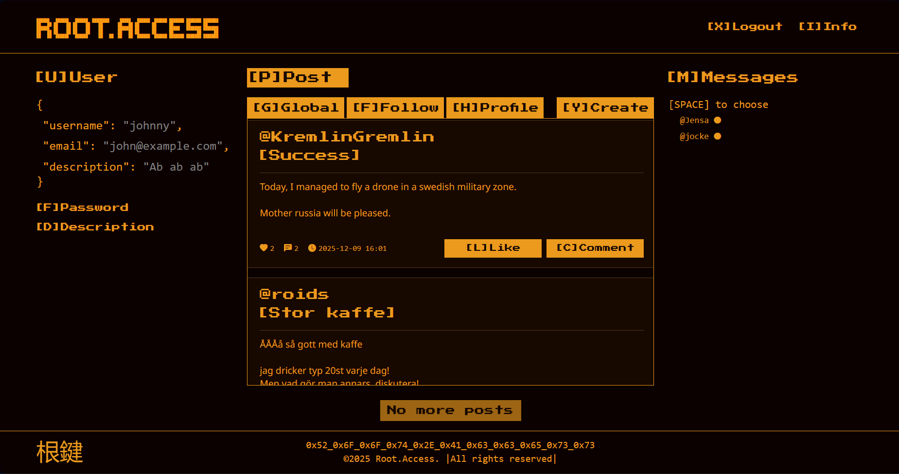
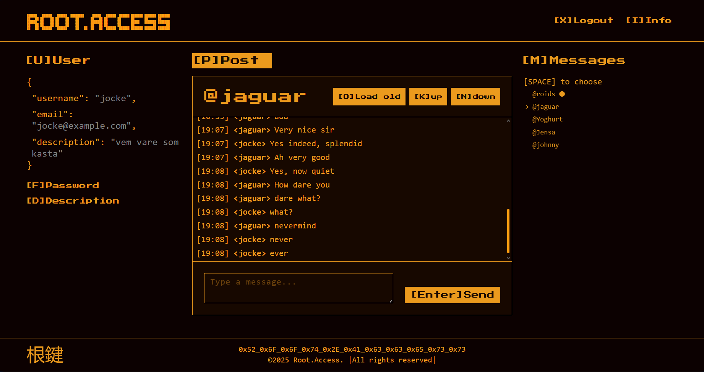
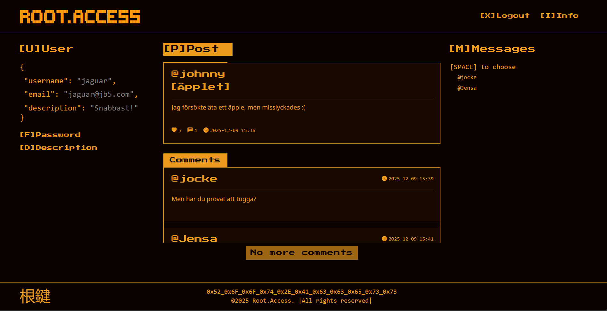

# Social

A social media app, built as a school project.
Using .Net Core, EF Core and SignalR in the backend.
Frontend built with React & typescript 

### Features

- User authentication and profiles
- Create and view posts with likes and comments
- Real-time messaging with SignalR
- Keyboard shortcuts for navigation

<p align="center">
  
</p>


## To run it

Backend also starts at `npm start`

```bash
cd social-frontend
npm install
npm start
```


<p align="center">
  
</p>

## Keyboard Shortcuts

### Global
- `U` - Focus user profile
- `P` - Focus posts/center
- `M` - Focus messages
- `I` - Show info modal
- `L` - Logout

### Messages (when on message page)
- `O` - Load older messages
- `K` - Scroll to top
- `N` - Scroll to bottom
- `Enter` - Focus/send message
- `Escape` - Unfocus input

### User Profile (when focused)
- `F` - Edit password
- `D` - Edit description
- `S` - Save changes
- `C` - Cancel edit

### Conversations (when focused)
- `Arrow Up/Down` - Navigate conversations
- `Space` - Open selected conversation
- `Escape` - Unfocus list

<p align="center">
  
</p>
